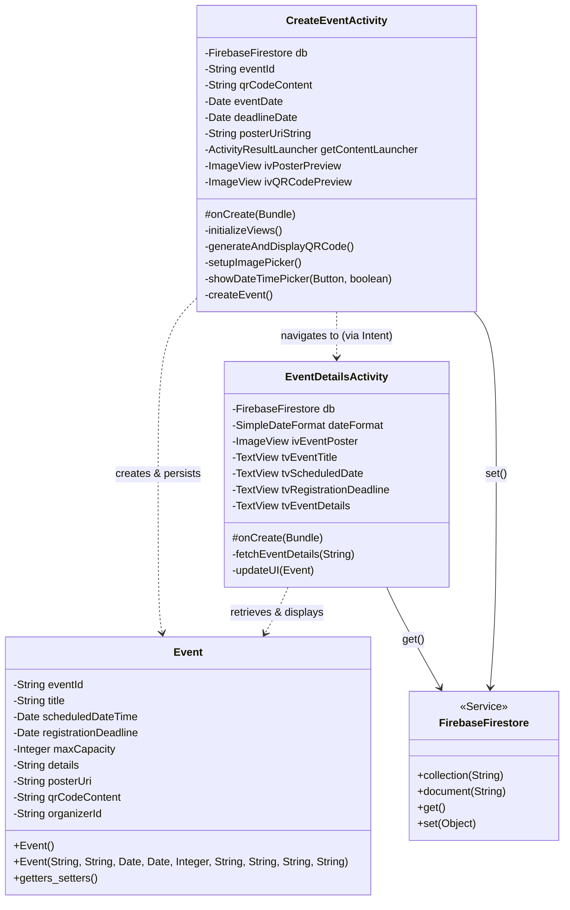

# Lottery Android Project - Event Management Feature

This project implements an event management system using Android (Java) and Firebase Firestore.

## Architecture Overview

The Event feature follows a model-activity pattern where data is persisted in a remote Firestore database.

### UML Class Diagram

## Implemented User Stories

- **US 02.01.01**: Create Event with a unique promotional QR code (ZXing integrated).
- **US 02.01.04**: Registration deadline management (with chronological validation).
- **US 02.04.01**: Upload and view event posters (Local URI implementation).

## Implementation Details

- **Backend**: Firebase Firestore (Collection: `events`).
- **Navigation**: CreateEventActivity automatically redirects to EventDetailsActivity upon success.
- **Validation**: Strict validation for required fields and logical date sequences.
- **Documentation**: Professional Javadoc provided for all model and activity classes.
